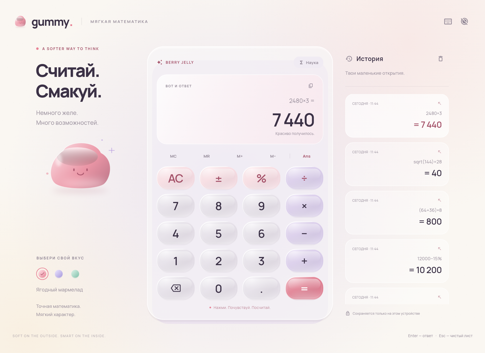

# Gummy — мягкая математика

Десктопный калькулятор на Flutter. Полупрозрачные мармеладные клавиши,
пружинная деформация, блики под курсором, мягкий фон и маленькое живое желе.
Вся графика рисуется Flutter; подключение к сети во время использования не нужно.



## Что умеет

- Три вкуса: ягодный, лавандовый и мятный. Выбор сохраняется.
- Клавиши сплющиваются при нажатии и возвращаются с пружинным отскоком.
- Движение блика и лёгкий наклон при наведении мыши.
- История до 80 вычислений, возвращение выражения нажатием на запись.
- Предварительный результат во время ввода, копирование и вставка.
- Скобки, проценты, степени, квадратный корень, факториал, sin/cos/tan, ln/log.
- DEG/RAD, π, предыдущее значение Ans, память MC/MR/M+/M−.
- Адаптация к небольшому окну. Научные клавиши раскрываются кнопкой «Наука».
- Режим уменьшенного движения и поддержка системного отключения анимаций.
- Собственная рамка окна, перетаскивание, сворачивание и разворачивание.

## Windows: запустить

**Без установки Flutter на компьютер:** собери приложение через GitHub Actions.
Пошаговая инструкция — [GITHUB.md](GITHUB.md). GitHub выдаст архив с готовым
Windows `.exe`, данными и библиотеками для запуска.

Понадобятся Flutter SDK и Visual Studio 2022 с компонентом
**Desktop development with C++**. Visual Studio Code этот компонент не заменяет.

1. Установите Flutter: https://docs.flutter.dev/install
2. Распакуйте весь архив в папку с правом записи.
3. Запустите **Start-Windows.cmd**. Он получает зависимости и открывает приложение.

Если Flutter уже установлен и находится в PATH, достаточно двойного щелчка.
Можно также указать переменную `GUMMY_FLUTTER` с полным путём к `flutter.bat`.

Из терминала:

```powershell
flutter pub get
flutter run -d windows
```

## Получить Windows .exe

Запустите **Build-Windows.cmd** или выполните:

```powershell
flutter build windows --release
```

Готовая папка: `build/windows/x64/runner/Release/`.
Переносите **всю папку Release**, включая `data/` и DLL, а не только `.exe`.
На компьютере получателя Flutter не нужен. Может понадобиться Microsoft
Visual C++ Redistributable для x64.

Сборка Windows выполняется на Windows; macOS — на macOS; Linux — на Linux.

## macOS и Linux

```sh
flutter pub get
flutter run -d macos  # на macOS с Xcode
flutter run -d linux  # на Linux с GTK 3, Clang, CMake и Ninja
```

Сборка: `flutter build macos --release` / `flutter build linux --release`.
В корне также есть `start.sh`, который выбирает текущую платформу.

## Клавиатура

| Клавиша | Действие |
|---|---|
| 0–9, +, −, *, /, (, ), %, ^, ! | Числа и операции |
| Enter или = | Вычислить и сохранить в истории |
| Backspace | Удалить символ |
| Esc / Delete | Очистить выражение |
| Ctrl/⌘ + C | Копировать результат |
| Ctrl/⌘ + V | Вставить выражение |
| Ctrl/⌘ + H | Показать историю |
| S | Научный режим |
| P | π |
| R | Квадратный корень |
| A | Ans |
| ? | Подсказки |

## Как считаются проценты

`200 + 10% = 220`, `200 − 10% = 180`, `200 × 10% = 20`.
При сложении и вычитании процент относится к левой части операции.
Скобки и степени соблюдают математический приоритет: `−2^2 = −4`, `(−2)^2 = 4`.
В DEG аргументы sin/cos/tan заданы в градусах, в RAD — в радианах.

Вычисления используют 64-битные числа IEEE 754. Дисплей округляет до
12 значащих цифр. Это обычный калькулятор, для точных денежных расчётов
с большим количеством разрядов нужен десятичный тип.

## Проверки и превью

```sh
flutter analyze
flutter test
flutter test test/render_preview_test.dart --dart-define=RENDER_PREVIEWS=true
```

Последняя команда создаёт PNG из настоящего Flutter-интерфейса в `docs/previews/`.
Кадры желейного нажатия можно записать отдельно:

```sh
flutter test test/render_motion_test.dart --dart-define=RENDER_MOTION=true
```

Готовая демонстрация: [gummy-motion.gif](docs/previews/gummy-motion.gif).

Проверки покрывают математические крайние случаи, клавиатуру, восстановление
после ошибки, сохранение настроек и компоновку при разных размерах окна.

## Код

- `lib/engine/expression.dart` — самостоятельный математический парсер.
- `lib/engine/calculator.dart` — ввод, память, история и настройки.
- `lib/ui/jelly_button.dart` — физика пружины и материал клавиш.
- `lib/ui/jelly_art.dart` — процедурный фон и мармеладный персонаж.
- `lib/ui/calculator_screen.dart` — интерфейс и клавиатура.

Шрифт Manrope включён локально; лицензия SIL OFL находится в `assets/fonts/OFL.txt`.
Код проекта распространяется по лицензии MIT.
